## Motor Insurance Portfolio Insights {.cover}

::::: cover-inner
::: eyebrow
Executive Summary · Take-home Exercise 1
:::

<h1>Motor Insurance Portfolio Insights</h1>

Visual analytics of portfolio composition, claims behaviour, pricing adequacy, and loss concentration.

::: cover-meta
Prepared by Wang Yanshuang · 2026-5-20
:::
:::::

::: notes
This cover introduces the presentation as an executive visual analytics summary. The objective is to communicate the key portfolio patterns, risk signals, and management implications from the motor insurance analysis. The companion technical report documents the reproducible sandbox, data preparation, and implementation details.
:::

## Contents

::::::: agenda-grid
::: {}
01<b>Portfolio baseline</b>

Dataset scale, exposure, loss ratio, claim frequency, and derived metrics.

:::

::: {}
02<b>Composition and distributions</b>

Policy mix, underwriting profile, numerical skewness, and claim-count shape.

:::

::: {}
03<b>Segment risk patterns</b>

Policy type, bonus score, age bands, geography, and vehicle-brand indicators.

:::

::: {}
04<b>Pricing and actions</b>

Pricing deciles, loss concentration, and management recommendations.

:::
:::::::

::: notes
The structure follows the reference layout: each slide presents a focused visual pattern followed by interpretation. The story moves from portfolio baseline to distributional evidence, then into segment-level risk and actionable recommendations. This keeps the executive summary concise while still showing the statistical evidence behind the conclusions.
:::

## Observation 1 - Portfolio Baseline and Analytical Sandbox

:::::::: kpi-row
::: {}
<b>354,140</b>Policy-year records
:::

::: {}
<b>250,326</b>Total exposure
:::

::: {}
<b>70.3%</b>Portfolio loss ratio
:::

::: {}
<b>0.31</b>Claim frequency
:::

::: {}
<b>85.7%</b>No-claim share
:::
::::::::

::::::: method-line
::: {}
<b>Prepare</b> Import CSV and variable dictionary
:::

::: {}
<b>Transform</b> Recode categories and handle low missingness
:::

::: {}
<b>Measure</b> Derive frequency, severity, loss ratio, pure premium
:::

::: {}
<b>Analyse</b> Use distribution, segment, interaction, and concentration views
:::
:::::::

::: observation-box
- The portfolio is large enough for robust segment-level visual analytics across 2022-2024. 
- The aggregate loss ratio of <b>70.3%</b> is acceptable, but the high no-claim share shows a zero-inflated claims process. 
- The sandbox normalises experience by exposure and premium, allowing fair comparisons across policy types, years, and risk segments.
:::

::: notes
The baseline establishes both scale and analytical caution. Although the aggregate loss ratio is 70.3%, 85.7% of policy-year records have no claims. This means the portfolio average is shaped by a relatively small share of claim-generating records. The sandbox therefore creates exposure-normalised and premium-normalised measures before interpreting segment patterns.
:::

## Insight 2 - Policy Mix and Portfolio Composition

::::::: two-chart
:::: panel
::: panel-title
Policy type mix
:::

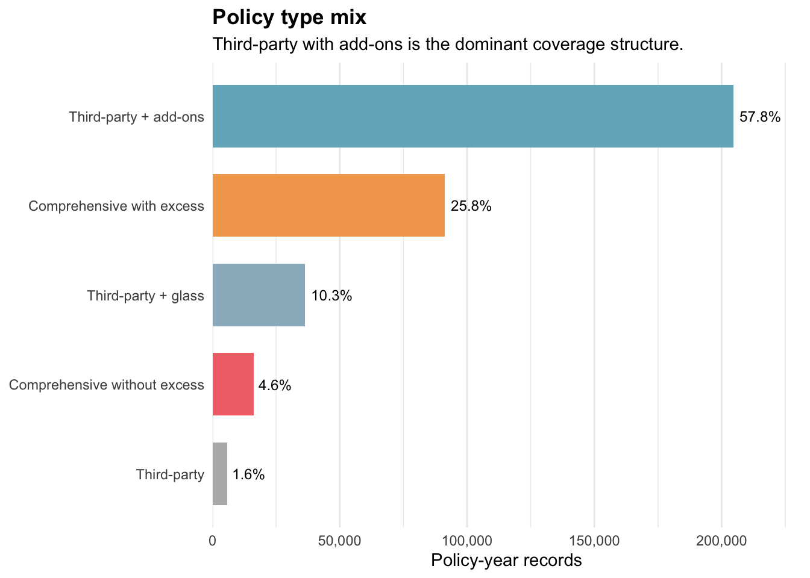
::::

:::: panel
::: panel-title
Bonus, payment, fuel, and circulation mix
:::

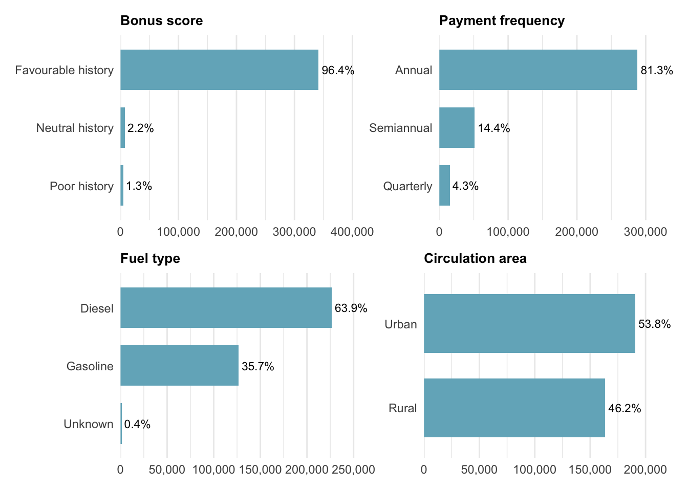
::::
:::::::

::: observation-box
- <b>Third-party + add-ons</b> is the dominant coverage structure, representing <b>57.8%</b> of policy-year records. 
- The portfolio is concentrated in favourable bonus history, annual payment, diesel vehicles, and urban circulation. 
- Composition effects are important because large segments drive averages, while smaller segments may still carry disproportionate profitability risk.
:::

::: notes
The composition view shows where portfolio averages come from. Third-party with add-ons is the largest policy type, followed by comprehensive with excess. The wider portfolio is also heavily weighted toward favourable bonus-score policies and annual payment. These distributions help explain why an acceptable aggregate loss ratio can mask very different results in smaller coverage or risk cells.
:::

## Insight 3 - Numerical Variables Are Skewed

::: {.single-chart .wide}
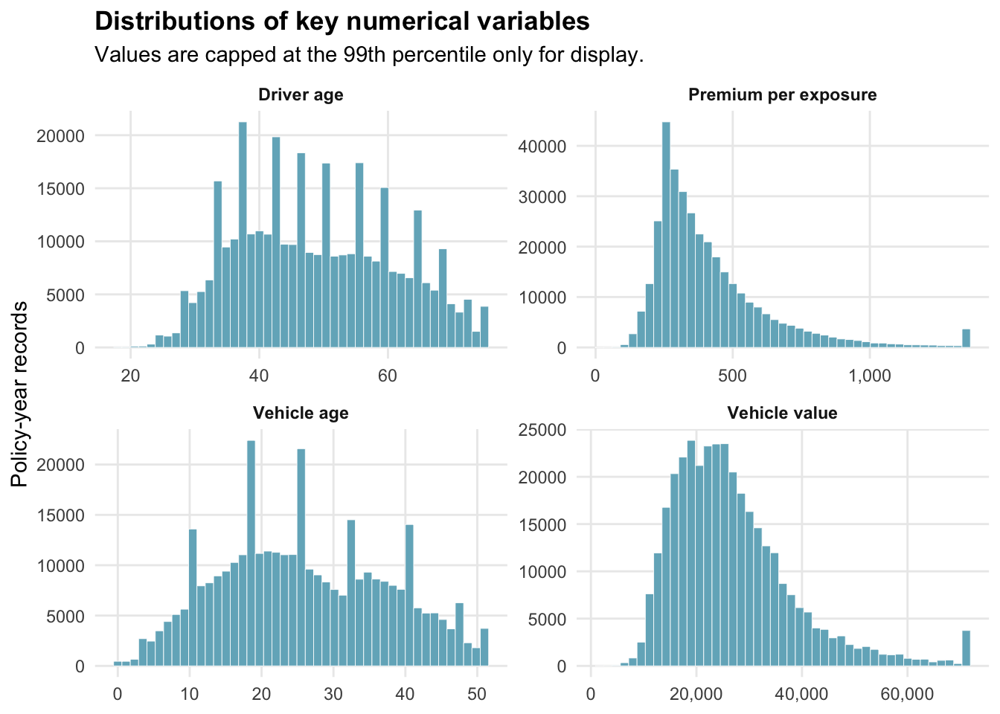
:::

::: observation-box
- Driver age and vehicle age have broad distributions, suggesting heterogeneous customer and vehicle profiles. 
- Vehicle value and premium per exposure are visibly right-skewed, so mean-only summaries may be misleading. 
- Values are capped at the 99th percentile only for display, preserving readability while retaining full-data interpretation.
:::

::: notes
The numerical distributions show why visual analytics is necessary. Premium per exposure and vehicle value have long right tails, which can compress the main distribution if plotted without display treatment. The cap is used only for display. It allows the common range to be seen while the analytical conclusions still refer to the full portfolio.
:::

## Insight 4 - Claim Occurrence and Loss Amounts Behave Differently

::: {.single-chart .wide}
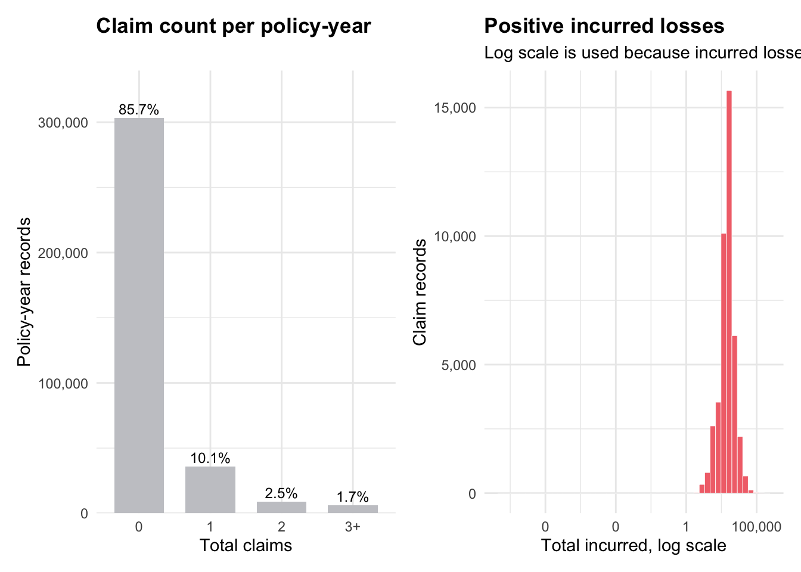
:::

::: observation-box
- <b>85.7%</b> of policy-year records have zero claims, confirming strong zero inflation. 
- Positive incurred losses are right-tailed; a log scale makes the severity distribution interpretable. 
- Frequency and severity should be analysed separately because they represent different risk mechanisms.
:::

::: notes
The claim count chart shows that claim occurrence is rare at the policy-year level, while the positive incurred-loss distribution is highly skewed. These two patterns should not be collapsed too early. Frequency indicates how often claims arise; severity indicates how expensive claims are once they occur. Managing them separately improves pricing and claims insight.
:::

## Insight 5 - Premium Distribution Varies by Policy Type

::: single-chart
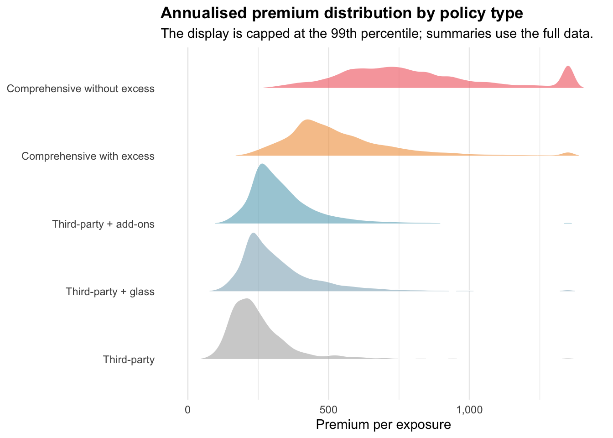
:::

::: observation-box
- Premium per exposure generally increases with coverage breadth, as expected for wider protection. 
- Ridgeline distributions show spread, overlap, and tails across policy types rather than only average premiums. 
- The visible distributional overlap suggests that vehicle, driver, geography, and underwriting variables also influence premium levels.
:::

::: notes
The ridgeline plot is useful because pricing is not just a single point estimate. It shows how premium per exposure is distributed within each policy type. Comprehensive covers generally sit higher, but the overlap across policy types indicates that coverage type alone does not explain premium variation. Other risk factors are also contributing.
:::

## Insight 6 - Growth Has Been Accompanied by Profitability Drift

::: {.single-chart .medium}
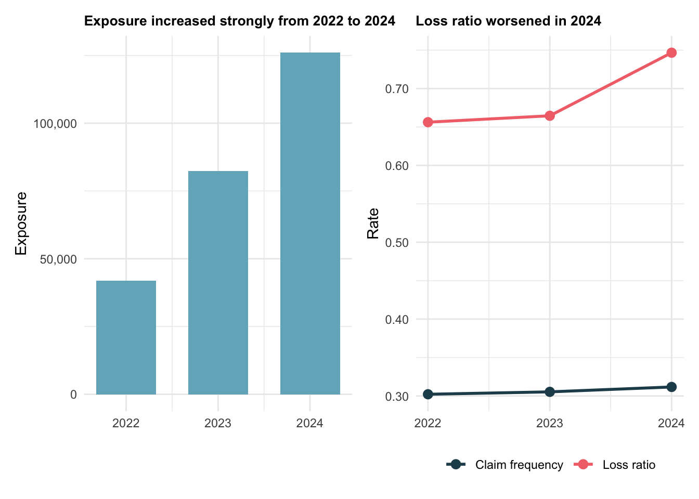
:::

::: observation-box
- Exposure increased strongly from 2022 to 2024, indicating rapid portfolio growth. 
- Loss ratio worsened in 2024, while claim frequency increased only modestly. 
- The pattern suggests that growth quality should be monitored using severity, mix, and pricing adequacy indicators, not exposure alone.
:::

::: notes
The trend view separates business growth from risk quality. Exposure expanded strongly, but the 2024 loss ratio worsened. Because frequency changed only modestly, the deterioration may come from severity, pricing adequacy, or a change in portfolio mix. This makes the case for risk-adjusted growth monitoring.
:::

## Insight 7 - Policy Type Is the Strongest Risk Separator

::: single-chart
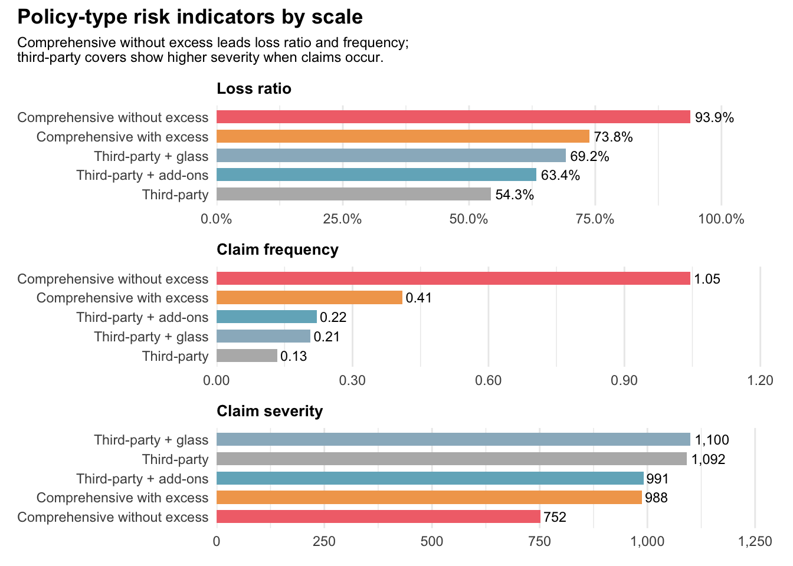
:::

::: observation-box
- <b>Comprehensive without excess</b> has the highest loss ratio at <b>93.9%</b> and the highest claim frequency at <b>1.05</b>. 
- Third-party covers show lower loss ratios and lower frequencies, although severity can still be material when claims occur. 
- The high-risk comprehensive segment should be prioritised for pricing and underwriting review.
:::

::: notes
The policy-type view identifies the most actionable risk signal. Comprehensive without excess combines the highest loss ratio with the highest frequency. Its severity is not the highest, which means the key pressure point is claim occurrence rather than unusually expensive average claims. This makes it a clear priority for pricing and eligibility review.
:::

## Insight 8 - Bonus Score and Age Bands Reveal Risk Trade-offs

::::::: two-chart
:::: panel
::: panel-title
Bonus score risk separation
:::

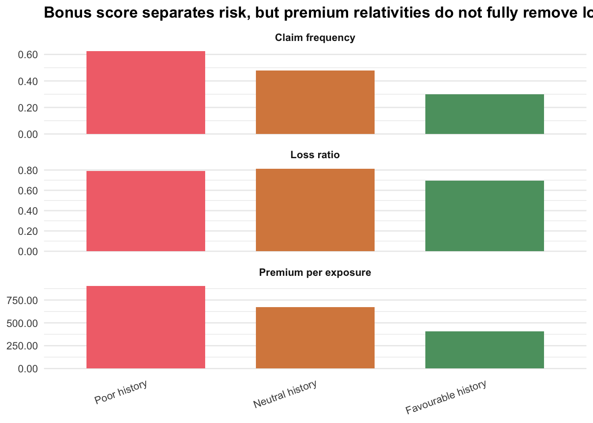
::::

:::: panel
::: panel-title
Driver and vehicle age bands
:::

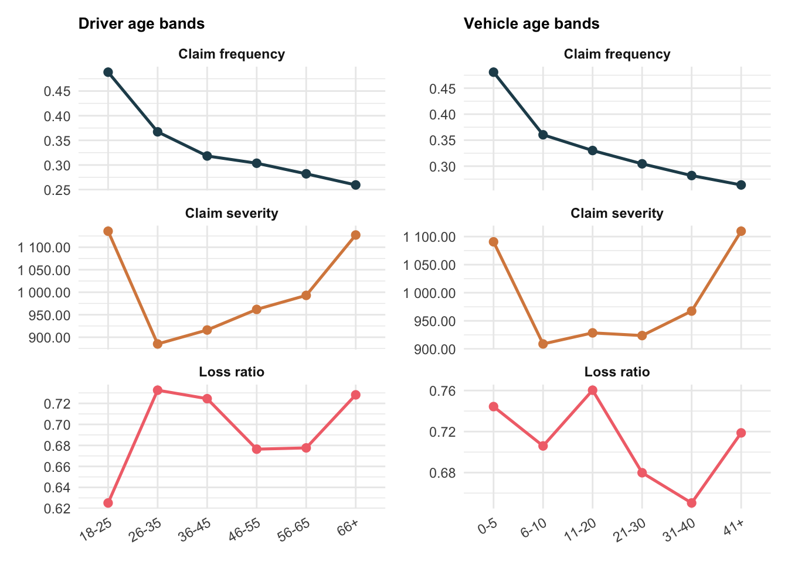
::::
:::::::

::: observation-box
- Bonus score separates frequency risk directionally, but residual loss-ratio differences remain. 
- Claim frequency generally declines with older driver and vehicle age bands. 
- Severity rises again in older bands, creating a frequency-severity trade-off that requires careful pricing treatment.
:::

::: notes
Bonus history is working as a risk signal because poor-history policies show higher frequency and higher premium. However, pricing relativities may not fully remove loss-ratio differences. Age bands add a second pattern: older bands tend to claim less often, but severity rises again in some older groups. This means age cannot be priced as a simple linear effect.
:::

## Insight 9 - Geography and Vehicle Brand Expose Risk Pockets

::::::: two-chart
:::: panel
::: panel-title
Loss ratio by policy and geography
:::

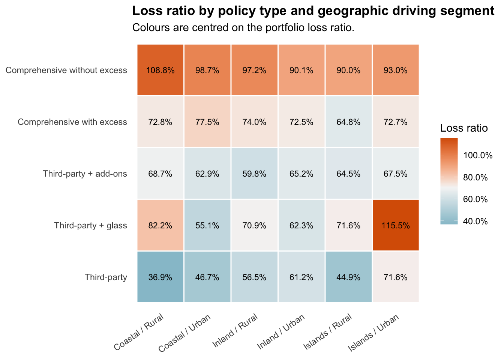
::::

:::: panel
::: panel-title
Vehicle brand risk and exposure
:::

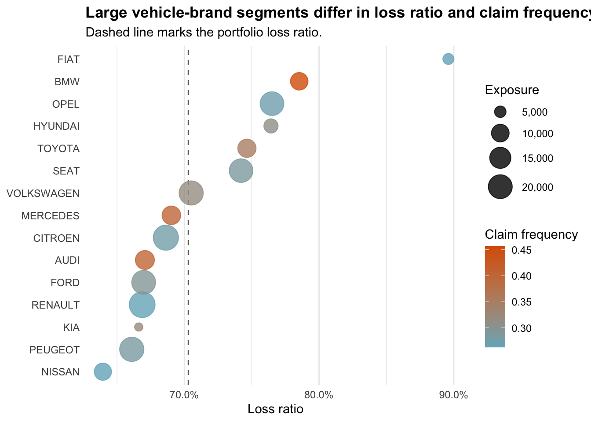
::::
:::::::

::: observation-box
- Policy type remains a stronger differentiator than geography, but geographic cells still reveal elevated loss-ratio pockets. 
- Brand bubbles combine loss ratio, exposure, and frequency, helping separate operationally material issues from small-cell noise. 
- High-risk cells are most actionable when adverse performance and meaningful exposure occur together.
:::

::: notes
The heatmap and bubble chart move the analysis beyond one-dimensional segmentation. The heatmap highlights interaction effects between policy type and geography. The bubble chart adds exposure size and claim frequency to brand performance. This is important because high ratios in very small cells can be less important than moderately high ratios in large segments.
:::

## Insight 10 - Pricing Deciles Are Directional but Not Fully Calibrated

::: single-chart
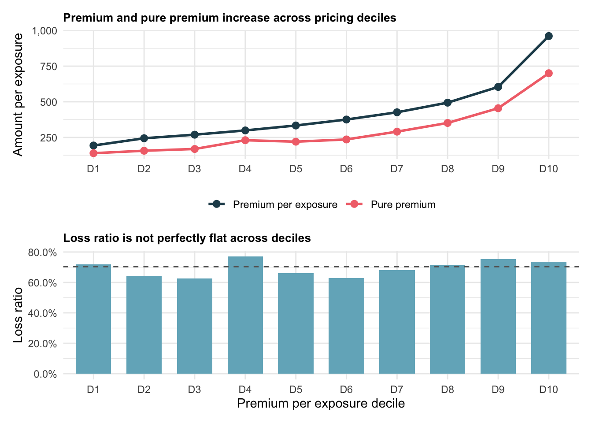
:::

::: observation-box
- Premium and pure premium generally increase across pricing deciles, showing directional risk sensitivity. 
- Loss ratio is not perfectly flat across deciles, which suggests residual mispricing or volatility. 
- Decile-level monitoring should be used to test whether price levels are aligned with realised loss cost.
:::

::: notes
The decile chart is a pricing adequacy check. If pricing perfectly matched risk, loss ratio would be more stable across deciles. Instead, premium and pure premium rise together, but the loss ratio still varies. This indicates that the pricing model is directionally useful but not perfectly calibrated across the portfolio.
:::

## Insight 11 - Incurred Losses Are Highly Concentrated

::: {.single-chart .medium}
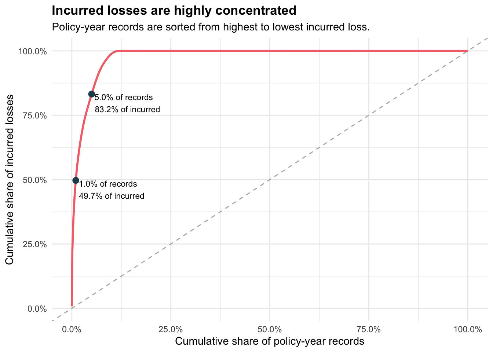
:::

::: observation-box
- The top <b>1.0%</b> of policy-year records account for <b>49.7%</b> of incurred losses. 
- The top <b>5.0%</b> account for <b>83.2%</b> of incurred losses, confirming high loss concentration. 
- Portfolio volatility should be monitored through large-loss and concentration diagnostics, not only average loss ratio.
:::

::: notes
The concentration curve is one of the strongest statistical insights. A small share of records drives a large share of incurred losses. This explains why the portfolio can appear stable on average while still carrying substantial volatility. A large-loss monitoring process should therefore be part of regular portfolio governance.
:::

## Recommended Actions

::::::: action-grid
::: {}
<b>01 · Review comprehensive without excess</b>

Reassess eligibility, deductibles, pricing loadings, and claims controls for the highest frequency and loss-ratio segment.

:::

::: {}
<b>02 · Recalibrate bonus-score relativities</b>

Test whether poor and neutral histories receive sufficient loadings after allowing for policy type and vehicle mix.

:::

::: {}
<b>03 · Govern growth quality</b>

Track loss ratio, frequency, severity, and pure premium alongside exposure growth, especially for the 2024 book.

:::

::: {}
<b>04 · Monitor tail concentration</b>

Build recurring large-loss, brand, geography, and pricing-decile diagnostics for portfolio review.

:::
:::::::

::: observation-box
- The analysis supports targeted action rather than broad portfolio-wide intervention. 
- Priority should be based on both adverse performance and exposure materiality. 
- The same visual workflow can be reused as a recurring underwriting and pricing monitoring tool.
:::

::: notes
The recommended actions are prioritised by materiality. The first focus is comprehensive without excess because it combines high frequency and high loss ratio. The second is bonus-score recalibration because it is a major underwriting signal. The third is growth governance, and the fourth is tail monitoring because severe losses are highly concentrated.
:::

## Closing Summary

::::::: closing-grid
::: {}
Pattern<b>The portfolio is profitable on average but heterogeneous underneath.</b>
:::

::: {}
Distribution<b>Claims are zero-inflated and incurred losses are concentrated.</b>
:::

::: {}
Segmentation<b>Policy type, bonus score, age, geography, and brand reveal distinct risk mechanisms.</b>
:::

::: {}
Decision<b>Pricing and underwriting should prioritise high-exposure, high-loss-ratio cells.</b>
:::
:::::::

::: notes
The executive message is that averages are not enough for this portfolio. The visual evidence shows concentration in composition, skewness in numerical variables, zero inflation in claims, and severe concentration in incurred losses. The most useful management response is targeted: address the highest-risk policy type, recalibrate risk relativities, and monitor tail losses continuously.
:::
