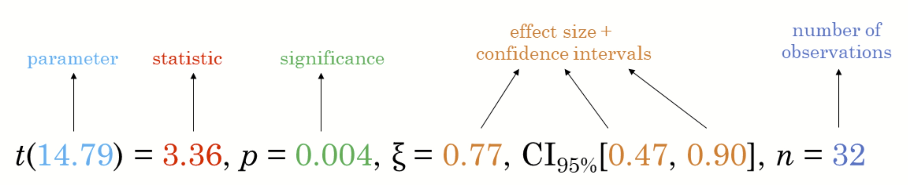

## **Visual Statistical Analysis with ggstatsplot**

ggstatsplot is an extension of ggplot2 package for creating graphics with details from statistical tests included in the information-rich plots themselves.



## **Getting Started**

### **Installing and launching R packages**

```{r}
pacman::p_load(ggstatsplot, tidyverse)
```

### **Importing data**

```{r}
exam <- read_csv("data/Exam_data.csv")
print(exam, n = 10)
```

### **One-sample test: *gghistostats()* method**

```{r}
set.seed(1234)

gghistostats(
  data = exam,
  x = ENGLISH,
  type = "bayes",
  test.value = 60,
  xlab = "English scores"
)
```

### **Unpacking the Bayes Factor**

- A Bayes factor is the ratio of the likelihood of one particular hypothesis to the likelihood of another. It can be interpreted as a measure of the strength of evidence in favor of one theory among two competing theories.

- That’s because the Bayes factor gives us a way to evaluate the data in favor of a null hypothesis, and to use external information to do so. It tells us what the weight of the evidence is in favor of a given hypothesis.

- When we are comparing two hypotheses, H1 (the alternate hypothesis) and H0 (the null hypothesis), the Bayes Factor is often written as B10. It can be defined mathematically as

  

  ### **How to interpret Bayes Factor**

  A **Bayes Factor** can be any positive number. One of the most common interpretations is this one—first proposed by Harold Jeffereys (1961) and slightly modified by [Lee and Wagenmakers](#0) in 2013:

  

### **Two-sample mean test: *ggbetweenstats()***

```{r}
ggbetweenstats(
  data = exam,
  x = GENDER, 
  y = MATHS,
  type = "np",
  messages = FALSE
)
```

### **Oneway ANOVA Test: *ggbetweenstats()*method**

```{r}
ggbetweenstats(
  data = exam,
  x = RACE, 
  y = ENGLISH,
  type = "p",
  mean.ci = TRUE, 
  pairwise.comparisons = TRUE, 
  pairwise.display = "s",
  p.adjust.method = "fdr",
  messages = FALSE
)
```

- “ns” → only non-significant

- “s” → only significant

- “all” → everything

  #### ggbetweenstats - Summary of tests

  


### **Significant Test of Correlation: *ggscatterstats()***

```{r}
ggscatterstats(
  data = exam,
  x = MATHS,
  y = ENGLISH,
  marginal = FALSE,
  )
```

### **Significant Test of Association (Depedence) : *ggbarstats()* methods**

```{r}
exam1 <- exam %>% 
  mutate(MATHS_bins = 
           cut(MATHS, 
               breaks = c(0,60,75,85,100))
)
```

```{r}
ggbarstats(exam1, 
           x = MATHS_bins, 
           y = GENDER)
```
